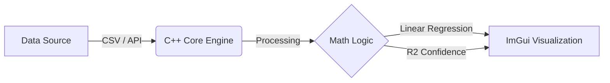

<div align="center">

# 📈 AI Market Intelligence Engine
### High-Performance Financial Analysis & Decision Support System


<p align="center">
  <b>"Bringing Hedge Fund Intelligence to the Retail Trader."</b><br>
  <i>A hybrid system combining low-latency C++ visualization with AI-driven market logic.</i>
</p>

</div>

---

## 🧐 The Problem
Retail traders face two major issues:
1.  **Information Overload:** It is impossible to read 5,000 news articles and strategy books daily.
2.  **Black Box Tools:** Existing bots say "Buy" or "Sell" but never explain **why**, making them essentially gambling tools.

## 💡 The Solution
The **AI Market Intelligence Engine** is not just a chart; it is a **Decision Support System**.
* **Speed:** It uses C++ to render charts at 60 FPS with zero latency.
* **Logic:** It uses custom Linear Regression algorithms to mathematically predict trends.
* **Explainability (Coming Soon):** It will use RAG (AI) to cite "Book Knowledge" alongside its predictions.

---

## 📸 Dashboard Preview
*()*
> *Phase 1 Dashboard showing Linear Regression Trend Line on Historical Data.*

---

## 🏗️ System Architecture
The project follows a modular "Body & Brain" architecture:



### 1. The Core (C++17)

* **Data Loader:** Robust parsing of financial CSV data sets.
* **Math Engine:** Custom implementation of Least Squares Method () to calculate slopes and intercepts.
* **Visualizer:** Built on **OpenGL** + **ImPlot** for real-time interaction (Pan/Zoom).

---

## 🗺️ Project Roadmap

### ✅ Phase 1: The Visualization Engine (Completed Dec 2025)

* [x] Set up CLion & CMake environment.
* [x] Build CSV Data Ingestion Pipeline.
* [x] Implement Linear Regression Algorithm from scratch.
* [x] Design Dark-Mode Dashboard using ImGui.
* [x] Visualize Trend Lines and Confidence Intervals.

### 🚧 Phase 2: The "Smart" Upgrade (Jan 2026)

* [ ] **Live Data:** Connect to Binance API for real-time price updates.
* [ ] **Python Bridge:** Integrate Python backend for AI processing.
* [ ] **RAG Integration:** Connect to Vector DB to "read" financial books.
* [ ] **Sentiment Analysis:** Score live news headlines.

---

## ⚙️ How to Build & Run

### Prerequisites

* C++ Compiler (MinGW or MSVC)
* CMake (Version 3.20+)
* CLion or Visual Studio Code

### Installation Steps

```bash
# 1. Clone the repository
git clone [https://github.com/Bilal-Fayaz/StockPredictor.git](https://github.com/Bilal-Fayaz/StockPredictor.git)

# 2. Navigate to directory
cd StockPredictor

# 3. Build with CMake
mkdir build
cd build
cmake ..
make

# 4. Run the Application
./StockPredictor

```

**Note:** Ensure `sample_data.csv` is present in the working directory for the simulation to work.

---

## 📂 Project Structure

```plaintext
StockPredictor/
├── src/
│   ├── main.cpp          # Entry point & GUI Loop
│   ├── predictor.cpp     # Math & Regression Logic
│   └── data_loader.cpp   # CSV Parsing Logic
├── include/
│   └── predictor.h       # Header definitions
├── data/
│   └── sample_data.csv   # Historical test data
├── CMakeLists.txt        # Build configuration
└── README.md             # Documentation

```

---

## 👨‍💻 Author

<div align="center">

**Bilal Fayaz**


*Computer Science Student @ NUTECH Islamabad*

[LinkedIn Profile](https://www.google.com/search?q=https://www.linkedin.com/in/bilal-fayaz-391837382) • [GitHub Profile](https://www.google.com/search?q=https://github.com/Bilal-Fayaz)

</div>